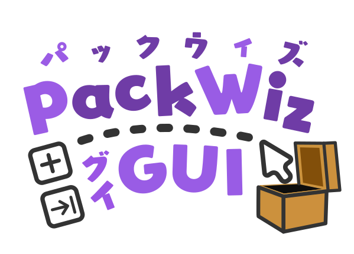

        
    <h1>PW-GUI</h1>
    
A lightweight GUI Wrapper around <a href="https://github.com/packwiz/packwiz">packwiz</a>, a tool for managing Minecraft modpacks.

    
    
    
    

---

PW-GUI is a tool designed to simplify modpack management by providing a graphical interface around the command-line tool [packwiz](https://packwiz.infra.link).

The end goal is that newcomers should be able to get started authoring their own Minecraft modpack with packwiz, as well as offering an overview of the modpack.

## What stuff can it do?
- You can create a modpack from scratch
- You can import a CurseForge modpack
- You can export a modpack to Modrinth (.mrpack) / CurseForge (.zip) format
- You can preview various files in the modpack and modify them
- You can add new content from Modrinth/CurseForge/Direct URL
- *TLDR: Pretty much most things the packwiz CLI do, just in GUI!*

### What (more) stuff can it do?
- In-app downloading of the packwiz executable
- Edit preserve state of each file (Whether the file should be overriden by players)
- Mark mod as optional, pinned, as well as modifying different "sides"
- Interactive manual download for blocked CurseForge mod
- gitignore and packwizignore preview

## Using PW-GUI!
PW-GUI requires **Java 17 or above** to run.  
If you don't have Java yet, you can download them at [Adoptium](https://adoptium.net) (Or any other Java distributions)

After that, you can head to the [Release](https://github.com/AmberIsFrozen/PW-GUI/releases) page and download the latest release, run it and follow the instructions on screen.  

For detailed instructions, you can refer to the [Usage](./docs/Usage.md) page for details.

## Future Development
See [Roadmap](./docs/Roadmap.md)

## Contact / Support
If you are having issues when using the program or have some suggestions, feel free to open a new issue in the [Issues](https://github.com/AmberIsFrozen/PW-GUI/issues) page.  
While this is only a hobby project and I can't guarantee everything can and will be fixed/implemented, at the very least you are bring potential ideas to light, which may be useful for future users/contributors :)

Optionally you can also join the [Discord Server](https://discord.gg/jzbhWEBFPx) if you like chatting back-and-fourth better~

Or if you'd like to send some love, feel free to contact me via the above Discord Server, or email `amberfrost(at)lx862.com`, or even create a new [issue](https://github.com/AmberIsFrozen/PW-GUI/issues)!.

## License
This project is licensed under the [MIT License](./LICENSE).