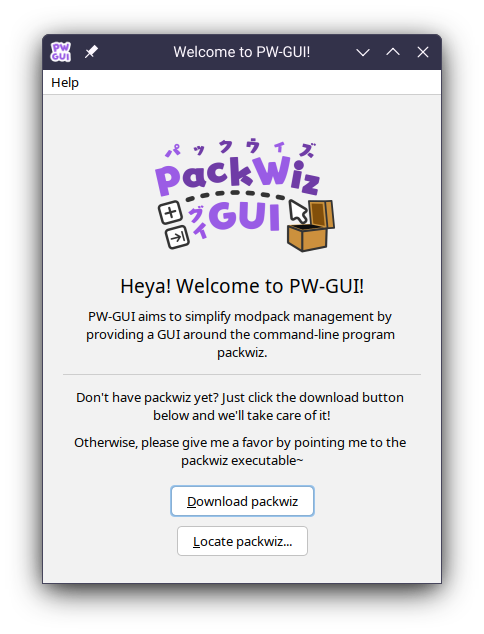
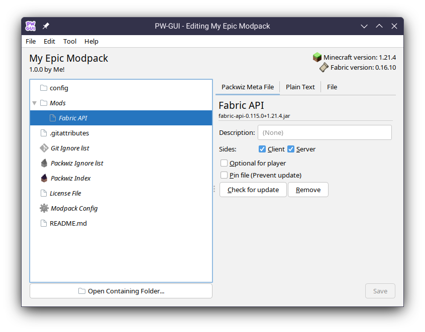
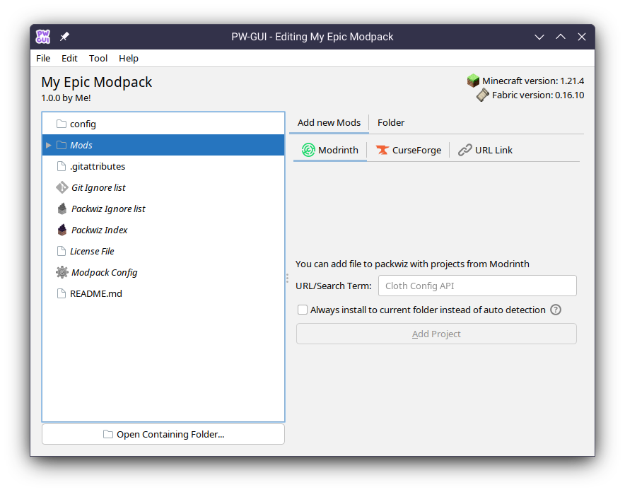

# Usage
Hopefully the program itself is intuitive enough that you do not need to resort to this page.  
However in the case it isn't, and for those just browsing around, you've come to the right place!

## Installation
PW-GUI is built on Java, and it requires Java 8 or above to run.  
If you don't have Java yet, you should install it first. [Adoptium](https://adoptium.net/) is usually a good place to start.

**Windows**  
An exe wrapper is created for Windows, and it is recommended to use this over the jar version. You can download the **.exe** file in the [Release](https://github.com/Kenny-Hui/releases) page.

**macOS/Linux/Windows Fallback**  
If you are unable to run the exe file or you are on other system, you can download the **.jar** file for macOS/Linux, and simply run it.

*Note: If you are unable to run it by double-clicking, try running it in a terminal with `java -jar <YOUR DOWNLOADED JAR FILE PATH HERE>`*  
*This might be caused by inappropriate file association on your system (Especially on Linux)*

---

On launch, PW-GUI will prompt you to either download packwiz, or locate the packwiz executable:

Clicking "Download Packwiz" would automatically download the packwiz executable via [nightly.link](https://nightly.link) within PW-GUI.  
If download is successful, it will automatically set itself up and launch into the main menu.

## Main User Interface
Fundamentally speaking, PW-GUI is just a File Explorer with Packwiz Integration. (Of course that's an understatement, but you get the idea)  

Here's one example of the main interface:  

At the top, you can see basic information about your modpack, its Minecraft version and modloader used. (If any)

On the Left is your file tree, or the list of files/folder your modpack contains.  
Note that PW-GUI will apply custom name (detonated by *italic font*) and icon to known files.

On the Right, you have the file preview, or "all operations related to the file".  
In this instance, there's 3 tabs: **Packwiz Meta File**, **Plain Text** and **File**.

Each tab contains different operations you can do. Some of them are read-only (For example Images, just for preview purposes), and some of them allows you to edit & save changes.

The reason these 3 tabs appears in the above image is that the selected file belongs to all 3 categories: It is both a packwiz meta file (.pw.toml). It is a plain text file, and finally it is a file on your computer.  

## Adding Contents
With the same logic as above, to add new mod, you can select the Mods folder:

Note that packwiz automatically determines which folder the content will be placed in, based on the category that is tagged on Modrinth/CurseForge.

If that's not desirable/the detection is not accurate, you can check **Always install to current folder instead of auto detection** to always put content to the current folder.

## Adding Files
One thing most modpack do have is that they contain mods. (duh!) (*Although it is possible to create a vanilla modpack in packwiz*)

However, often times you also want to ship various configurations into the modpack as well. For example, you want a pre-configured set of Minecraft Options (via options.txt), or you want to configure some mod in certain ways.

The way this is done is to literally ship the file into the modpack. In packwiz that is no exception, you simply put files into your modpack folder and it gets shipped!

Several Tips:
- Packwiz ignores some files by default, and those files won't be shipped to the modpack. You can check out *Packwiz Ignore List* in the file browser for a preview of what is/isn't ignored and to modify the rules.  
- You can access the modpack folder by clicking **Open Containing Folder...** at the bottom.  
- Packwiz uses the *Index File* to keep track of various files in the modpack. It is good practice to refresh the index after you put in some files outside of PW-GUI. This can be done in **Tool > Refresh Pack Index** in the toolbar at the top.